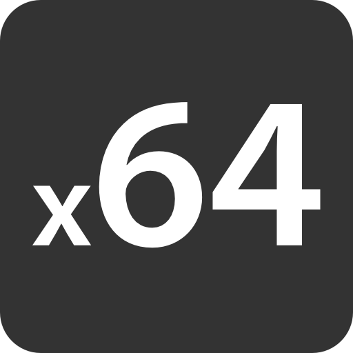
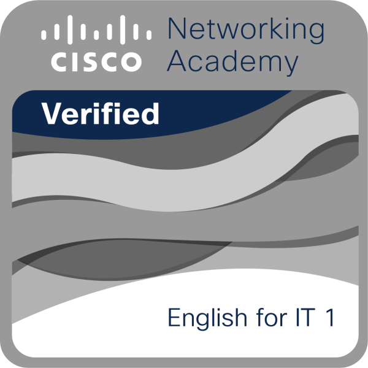

Étudiant à [42](https://42.fr/), passionné par le développement logiciel et les technologies open source.  
Je m'intéresse particulièrement à la conception d’outils fiables, performants et maintenables.
J'aime les language bas niveau tel que le C ou l'assembleur 64 bits.

---

## 🛠️ Tech Stack

**Langages :**  
 

**Outils & environnements :**  

**Centres d’intérêt techniques :**  
Systèmes bas niveau · Algorithmie · DevOps · Sécurité

---

## 📊 Statistiques GitHub

## Certification

## Liens 

